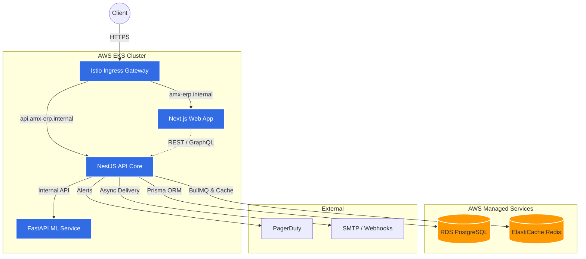

# AMX-ERP: The Spatial Enterprise OS 🚀

AMX-ERP is a next-generation Enterprise Resource Planning (ERP) platform designed as a living, spatially-aware operating system for the modern enterprise. It moves beyond static dark-mode dashboards into a fluid, reactive organism that breathes and responds to data in real-time.

---

## ✨ Design Philosophy

AMX-ERP represents a radical shift in enterprise UX:
- **Aurora Mesh Gradients:** Dynamic, time-shifting backgrounds that create a sense of life and spatial presence.
- **Spatial Depth:** A 6-level elevation system using glassmorphism, Z-index-aware shadows, and light refraction.
- **Physics-Based UI:** Smooth spring-based animations and magnetic interactions powered by Framer Motion.
- **Chromatic Refraction:** Iridescent gradient borders, glass panels, and plasma-effect focus states.
- **Dynamic Theming:** Implements full light/dark mode configuration utilizing Tailwind CSS v4 and `next-themes` for high-fidelity dark-glass and ice-glass aesthetics.

---

## 🏗️ Monorepo Structure

Built on **Turborepo** for high performance, simplified maintenance, and dependency caching:

- `apps/web` — **Next.js 16** (App Router) powered by Tailwind CSS v4, Framer Motion, and Zustand. Integrates offline PWA caching, background IndexedDB synchronization, and real-time Server-Sent Events (SSE).
- `apps/api` — **NestJS** backend core exposing REST + GraphQL gateways. Utilizes BullMQ for async mail/webhook queueing, and fits with a PostgreSQL database.
- `packages/db` — Shared Prisma module exposing schemas, migrations, and model exports to the NestJS core.
- `packages/typescript-config` & `eslint-config` — Shared architectural configurations.

---

## ⚙️ Core Technical Stack & Architecture

- **Frontend App Framework:** Next.js 16 (App Router), Tailwind CSS v4, Framer Motion, Recharts, `js-cookie`.
- **Backend API Core:** NestJS (v11), Apollo GraphQL (Apollo Server v4), Passport JWT security, EventEmitter2.
- **State & Theme Management:** Zustand (reactive stores), `next-themes` (system-adaptive layouts).
- **Persistent Databases:**
  - **PostgreSQL:** Production-grade multi-tenant database for `apps/api`.
  - **SQLite:** Lightweight local engine (`apps/web/dev.db`) using `@prisma/adapter-libsql` for 0ms-latency client-side mutations and optimistic updates.
- **Asynchronous Task Processing:** **Redis** + **BullMQ** processing asynchronous notification deliveries with exponential backoff retries and dead-letter queues.

---

## 🚀 Advanced Enterprise Features

The platform is supercharged with high-utility enterprise-grade workflows:

### 1. Unified GraphQL Gateway
* Exposed at `/graphql` on the API Core, powered by Apollo Server (code-first schema).
* Integrates high-performance queries and mutations for Finance (`invoices`, `transactions`), HR (`employees`, `payrollRuns`), Supply Chain (`vendors`, `purchaseOrders`), and Analytics.
* Fully protected by a custom `GqlAuthGuard` enforcing strict multi-tenant database isolation.

### 2. Real-Time Notification Engine
* **In-App SSE Stream:** Seamless Server-Sent Events pushed real-time to active clients via `/api/notifications/stream`.
* **Async Job Processing:** Uses Redis-backed BullMQ for background mail delivery (Nodemailer) and webhook posts.
* **HMAC Outbound Webhooks:** Signs outgoing JSON payloads with SHA-256 HMAC signatures for cryptographically secure endpoint verification.
* **Role-Aware Filtering:** Connects with the frontend toast system and notification bell badge.

### 3. Progressive Web App (PWA) & Offline Sync
* **Service Worker Caching:** Fully configures versioned cache strategies in `sw.js` (static assets cache-first; API endpoints network-first with cache fallbacks).
* **Seamless Offline Caching:** If a user loses connection, read views (Invoices, Employees, Inventory) remain accessible via cache.
* **Background IndexedDB Replay:** Intercepts offline `POST`/`PUT`/`DELETE` operations, queues them securely in IndexedDB, and replays them automatically on network restoration.
* **PWA Assets:** Features gorgeous, pre-rendered high-resolution application icons for mobile/desktop installability.

### 4. Global Unified Command Palette
* Accessible via `Ctrl+K` / `Cmd+K` or the search trigger in the Topbar.
* Unified interface combining fast navigation, quick actions ("New Employee", "Create Invoice"), and automatic Role-Based Access Control (RBAC) filtering (e.g., hiding HR controls from Finance Leads).

---

## 🛠️ Getting Started

### 1. Prerequisites
- **Node.js 20.19.0+**
- **pnpm 9+**
- **Docker Desktop** (for PostgreSQL and Redis containers)

### 2. Dependency Installation
```powershell
pnpm install
```

### 3. Hydrate Local SQLite (Next.js Web)
Set up the SQLite database and populate it with initial mocks:
```powershell
# Navigate into the web app
cd apps/web

# Push schema directly
npx prisma db push

# Seed default employees, transactions, inventory, and POs
npx prisma db seed
```

### 4. Docker Infrastructure (NestJS Core)
Start PostgreSQL and Redis:
```powershell
docker-compose up -d
```

### 5. Running the Dev Server
Launch the workspace:
```powershell
# From the root directory
pnpm dev
```
* Access the Next.js Frontend at: `http://localhost:3000`
* Access the NestJS Core Swagger at: `http://localhost:3001/api`
* Access the GraphQL Apollo Playground at: `http://localhost:3001/graphql`

---

## 📜 Development Standards

- **Depth System:** Leverage the **6-level spatial depth elevation tokens** in `tokens.css`.
- **Fluid Animation:** Avoid linear transitions. Use spring-physics for natural and organic micro-interactions.
- **Optimistic State Updates:** Always wrap mutating actions in React transitions to deliver responsive feedback.
- **Strict Linting:** Run `pnpm lint` and `pnpm check-types` before opening a pull request.

---

## ☁️ Infrastructure & Cloud Deployment (Week 4)

AMX-ERP includes comprehensive Infrastructure as Code (IaC) and Kubernetes deployment manifests located in the `ops/` directory.

### 1. Terraform (AWS)
Provision the core AWS infrastructure (EKS Cluster, RDS Aurora Serverless v2 PostgreSQL 17, and ElastiCache Redis 7.1) using Terraform 1.9+.

```bash
cd ops/terraform
terraform init
terraform plan -out=tfplan
terraform apply "tfplan"
```

*Required Environment Variables:*
- `AWS_ACCESS_KEY_ID`
- `AWS_SECRET_ACCESS_KEY`
- `AWS_REGION` (default: `us-east-1`)

### 2. Kubernetes & Helm Charts
The application suite is deployed via a unified Helm chart configured for zero-trust networking (Istio mTLS) and horizontal auto-scaling (HPA).

```bash
cd ops/helm

# Deploy the AMX-ERP Suite
helm upgrade --install amx-erp ./amx-erp \
  --namespace amx-prod \
  --create-namespace \
  --set domain=amx-erp.internal \
  --set autoscaling.enabled=true
```

**Architecture Topology:**
- **Ingress:** Istio Gateway routing traffic based on hostnames (`amx-erp.internal` for web, `api.amx-erp.internal` for core).
- **Workloads:** Next.js Web Frontend, NestJS API Core, and FastAPI ML Service running as separate Deployments.
- **Resilience:** Configured with Pod Disruption Budgets (minAvailable: 1) and HPAs scaling on >70% CPU/Memory utilization.

### 3. Architecture Diagram


